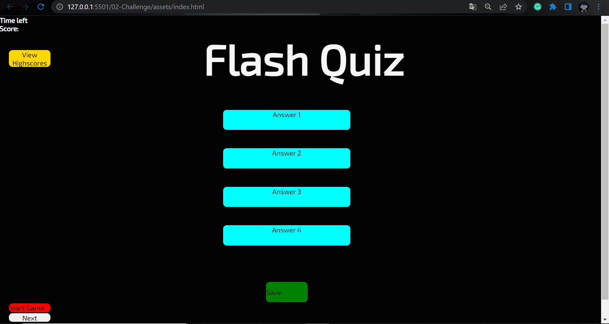

# Flash-quiz

A quiz game created with javascript principles incorporated with html and css

## Html

- I created the buttons (Answer, and game buttons)
- created the ul wherein the highscores will be stored

## CSS

- I gave a style for buttons, background and the name of the quiz

## Javascript

-I created a variable used to store the questions and answers
-I created a function that starts the game
-I created a Random question picker
-I created a function that Gives the next question and answers - I created a timer wherein Time starts at 40 and incorrect answer will deduct 10 secs from the timercount.

## Usage

## Credits

All credits goes to trilogy
